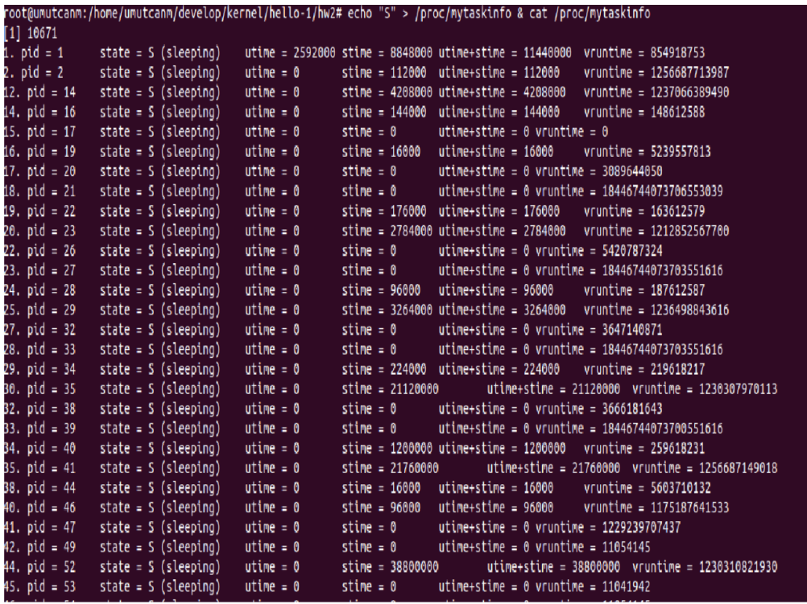
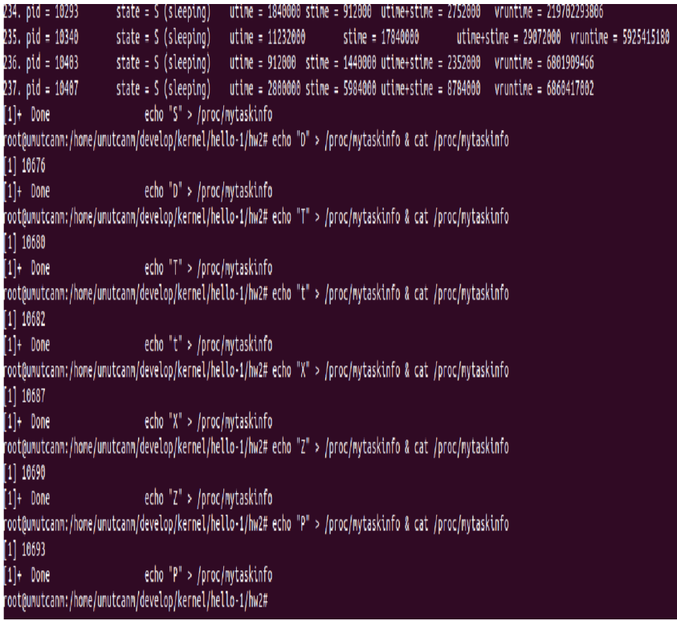
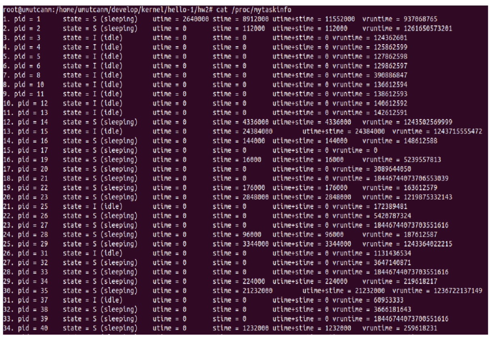
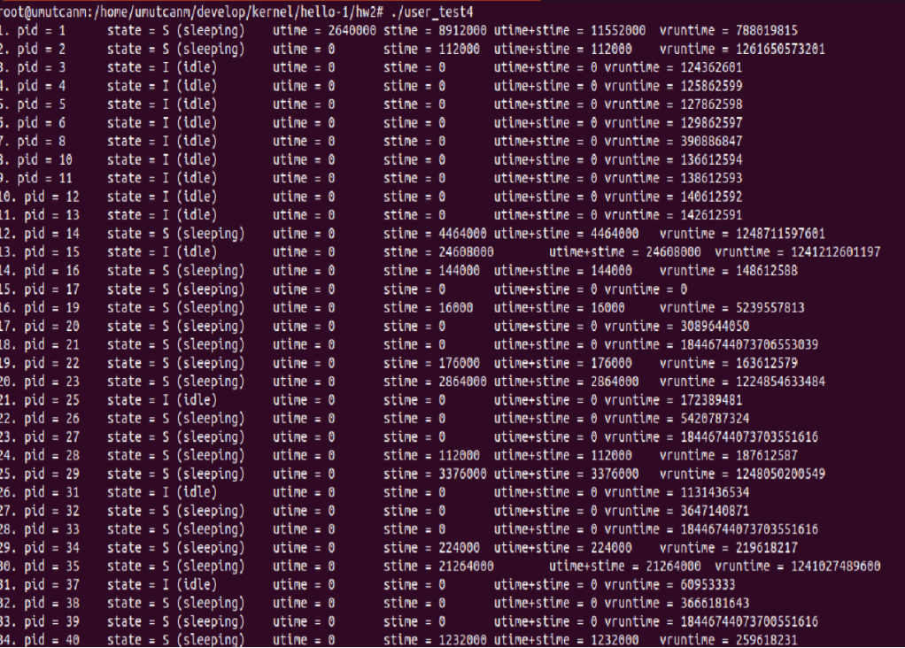

## Linux-Kernel-Module-for-Task-Information   
Grup üyeleri:
<br>
<a href="https://github.com/UmutcanMert">Umutcan Mert</a> <br>
<a href="https://github.com/Nihat-AYDIN">Nihat Aydın</a> <br>
<a href="https://github.com/hamza37yavuz">Muhammet Hamza Yavuz</a> <br>
<a href="https://github.com/s192275">Serhat Kılıç</a>
<hr>
/proc file system, process ve kernella alakalı farklı istatistiklere ulaşılabileceğiniz bir arayüz
olarak işlev görmektedir. Her bir /proc/pid ile pid idli processin istatistiklerine yada /proc/kerneldatastructure ile kerneldatastructure kısmına isim vererek ilgili bilgilerine erişebilirsiniz. mesela;

```
cat /proc/stat
```

```
ls /proc/irq/
```

```
ls /proc/irq/0/
```

------------------------

<h3>1.Linux Kernel Modülle /proc file systeme dosya eklemek</h3> 

<h4>1.1 Genel Ozet</h4>

Kernel tarafında struct file_operations ve kernel 5.6dan sonra eklenen proc_ops şeklinde data structurelar tanımlanmıştır. Bu data structureların temel özellikleri okuma ve yazma yapılırken çağrılacak fonksiyonları içermesidir.

```
struct proc_ops {

unsigned int proc_flags;

int (*proc_open)(struct inode *, struct file *);

ssize_t (*proc_read)(struct file *, char __user *, size_t, loff_t *);

ssize_t (*proc_read_iter)(struct kiocb *, struct iov_iter *);

ssize_t (*proc_write)(struct file *, const char __user *, size_t, loff_t *);

/* mandatory unless nonseekable_open() or equivalent is used */

loff_t (*proc_lseek)(struct file *, loff_t, int);

int (*proc_release)(struct inode *, struct file *);

__poll_t (*proc_poll)(struct file *, struct poll_table_struct *);

long (*proc_ioctl)(struct file *, unsigned int, unsigned long);

#ifdef CONFIG_COMPAT

long (*proc_compat_ioctl)(struct file *, unsigned int, unsigned long);

#endif
```

Temelde yapacağımız, bu data structure'ın **proc_open**, **proc_realese**, **proc_read**, **proc_write**
pointerlarına gerekli atamaları yaptıktan sonra(bunlar file uzerinde yapilacak islemlerin davranislarini belirleyecek) aşağıdaki foksiyonla /proc file systemda dosya oluşturacağız:

```
struct proc_dir_entry *proc_create(const char *name, umode_t mode, struct proc_dir_entry *parent, const struct proc_ops *proc_ops);
```

> device deriver yazarken farklı olarak /dev altında struct cdev mydevice... ile device file
oluşturduktan sonra fileoperations tipindeki mydevice.ops.read vb üyelerine ilgili atamalar yapılır
ve device_create ile device file oluşturulur (yada terminalden mknod kullanabilirsiniz.).

<hr>
<H4>1.2.module ile procfs’e file ekleme/çıkarma</H4>
proc file systemda dosya oluşturma kısmını module_init()’e; bu dosyayı kaldırma kısmınıda module_exit()e argüman olarak vereceğiz. Bunun için öncelikli olarak my_module_init()
ve my_module_exit() şeklinde iki tane fonksiyon tanımlayalım. Bunlarda temel olarak dosya oluşturup kaldıracağız (/include/linux/proc_fs.h):

```
/* my_module.c */
#include <linux/init.h> /* Needed for the macros */
#include <linux/kernel.h> /* Needed for pr_info() */
#include <linux/module.h> /* Needed by all modules */
#include <linux/proc_fs.h> /*proc_ops, proc)create, proc_remove, remove_proc_entry...*/
#define PROCF_NAME "mytaskinfo"
const struct proc_ops my_ops = {
.proc_read = NULL,
.proc_write = NULL,
.proc_open = NULL,
.proc_release = NULL,
/*bunlari kullanarak dosya davranislarini belirleyebilirsiniz*/
};

/* This function is called when the module is loaded. */
static int __init my_module_init(void)
{
/* creates the [/proc/procf] entry*/
proc_create(PROCF_NAME, 0666, NULL, &my_ops);
printk(KERN_INFO "/proc/%s created\n", PROCF_NAME);
return 0;
}

/* This function is called when the module is removed. */
static void __exit my_module_exit(void)
{
/* removes the [/proc/procf] entry*/
remove_proc_entry(PROCF_NAME, NULL);
printk(KERN_INFO "/proc/%s removed\n", PROCF_NAME);
}
/* Macros for registering module entry and exit points.
*/
module_init(my_module_init);
module_exit(my_module_exit);
MODULE_LICENSE("GPL");
MODULE_DESCRIPTION("My Task Info Module");
MODULE_AUTHOR("kendi isminiz");

```

Bu adımdan sonra **sudo insmod** ile modülü yüklediğinizde /proc fs de kendi oluşturduğunuz dosyayı
görebilmeniz gerekiyor.

```
$ ls /proc/mytaskinfo
/proc/mytaskinfo
```
<hr>
<h4>1.3 Olusturdugumuz file’in open ve closeda yapacaklarini belirleme</h4>

[/proc/procf] olusturduğumuz dosya acildiginda ve kapandiginda sistem defualtlarindan farkli olarak ne yapilacagini belirleyebiliriz. Bunun icin yukaridaki proc_ops data structure’inda tanimli pointerlara uygun olarak; bizde asagidaki fonksiyon tanimlamalarini kullanacagiz.

```
int my_open(struct inode *inode, struct file *file)
{
printk(KERN_INFO "my_ropen() for /proc/%s \n", PROCF_NAME);
return 0;
}
int my_release(struct inode *inode, struct file *file)
{
printk(KERN_INFO "my_release() for /proc/%s \n", PROCF_NAME);
return 0;
}
```

Yukarida yazdigimiz module’de eger asagidaki degisikligi yaparsak
```
const struct proc_ops my_ops = {
.proc_read = NULL,
.proc_write = NULL,
.proc_open = my_open,
.proc_release = my_release,
/*bunlari kullanarak dosya davranislarini belirleyebilirsiniz*/
};

```

bir tane user_test.c programi yazalim:

```
/** user_test.c
*
*/
#include <stdio.h>
#include <fcntl.h>
#include <unistd.h>
int main()
{
int fd = open("/proc/mytaskinfo", O_RDWR);
if (fd == -1)
{
printf("Couldn't open file\n");
return -1;
}
close(fd);
return 0;
}
```
Bu programi calistirdiktan sonra bash **$sudo dmesg** ile loga bakarak printk ile yukarida belirlemis olduğumuz mesajlarin yazildigini teyit edebilirsiniz.


<h4>1.4 Oluşturduğumuz file’dan read ve write yapma</h4>

Dikkat ettiyseniz yukarıda .proc_read = NULL, .proc_write = NULL, şeklinde başlatıldı. Buraya atadığımız değerler /proc/my_taskinfo dan read/write yapıldığında çağrılıyor. proc_read ve write aşağıdaki şekilde tanımlanmış:

>ssize_t (*proc_read)(struct file *, char __user *, size_t, loff_t *);

>ssize_t (*proc_write)(struct file *, const

>char __user *, size_t, loff_t *);

Bunun için proc_read ve proc_write pointerlarının tiplerine uygun olarak iki fonksiyon tanımlamamız gerekiyor.
```
ssize_t my_read(struct file *file, char __user *usr_buf, size_t size, loff_t *offset)
{

}
```
Yukaridaki fonksiyona baktigimiz zaman parametrelerinde bulunan >- file: kullanilan dosyayi(daha sonra bunu kullanarak datasini vs belirleyecegiz) >- usr_buf: kullanici tarafi bufferi >- size: bu bufferin size’ini >- *offset: en son kernel tarafindan kac karakter okundugu (bu bir nevi file cursor oluyor, bu degerin guncellenmesi my_read icerisinde yapilacak. Baslangicta deger 0)

<h4>1.5 Kernel space’den User Space’e data kopyalama</h4>

[/proc/mytaskinfo] uzerinden okuma islemini hem terminal üzerinden hemde herhangi bir dille
yazılan user programı ile yapabiliriz. Her nasıl olursa olsun sonuçta yazdığımız modul kernel’ın
bir parçası olduğu için kernel space’den user space’e (yada aksi yönde) kopyalama yapmamız gerekiyor. Bunun için system call yazarken kullanmış olduğumuz aşağıdaki fonksiyonları kul-
lanacağız(linux/uaccess.h):

``` 
unsigned long copy_to_user (void __user *to,
const void *from,
unsigned long n);
unsigned long copy_from_user (void *to,
const void __user *from,
unsigned long n);
```
Okurken strncpy_from_user da kullanabilirsiniz.
<hr>

/proc/file dan read yapma
```
#define MYBUF_SIZE 256
static ssize_t my_read(struct file *file, char __user *usr_buf, size_t size, loff_t *offset)
{
char buf[MYBUF_SIZE] = {'\0'};
int len = sprintf(buf, "Hello World\n");
/* copy len byte to userspace usr_buf
Returns number of bytes that could not be copied.
On success, this will be zero.
*/
if(copy_to_user(usr_buf, buf, len)) return -EFAULT;
return len; /*the number of bytes copied*/
}
```
Tipik olarak oluşturduğumuz dosyadan okuma yapmak için örnek olarak:
```
#include <stdio.h>
#include <fcntl.h>
#include <unistd.h>
int main()
{
int fd = open("/proc/mytaskinfo", O_RDWR);
if (fd == -1)
{
printf("Couldn't open file\n");
return -1;
}
char buf[256];
int r = read(fd, &buf, 256);
printf("return value: %d\n buf: %.256s\n", r, buf);
close(fd);
return 0;
}
```

Yukarıdaki örnekte hem user programı buffer size’i yeterli büyüklükte olduğu için, kopyalama işlemi
tek seferde bitti. Bazen bu durum öyle olmayabilir ve user programı normal bir dosyadan belirli
büyüklüklerde birden fazla cagri ile okuma yapmak isteyebilir.
1. Bu durumda *offset degerini her seferinde set ederek, sonraki cagrilarda kaldigimiz yerden
okumaya devam etmeliyiz (yani buf+ *offset degerinden).
```
if (copy_to_user(usr_buf, buf + *offset, len))
return -EFAULT;
*offset = *offset + len; /*offset(cursor position) degeri guncellendi*/
```
2. Yine kullanicinin vermis oldugu size ile data size’ni karsilastirilip buffer overflow yapmamak
icin kontrol etmeliyiz
```
int len = min(len - *offset, size);
if (len <= 0)
return 0; /*end of file*/
```

Yukaridaki degisiklikleri yaptiktan sonra, make ve insmod ile modulunuzu tekrar yukleyerek mesela
user_test2.c ile test ediniz:
```
/** user_test2.c
*
*/
#include <stdio.h>
#include <fcntl.h>
#include <unistd.h>
int main()
{
int fd = open("/proc/my_taskinfo", O_RDWR);
if (fd == -1)
{
printf("Couldn't open file\n");
return -1;
}
char buf;
int r;

/* On success, read returns the number of bytes read
(zero indicates end of file)*/
while ((r = read(fd, &buf, 1)) > 0)
{
printf("return value: %d\n buf: %c\n", r, buf);
}
close(fd);
return 0;
}
```

3. Dikkat ederseniz her cagrida datayi sprintf ile buffera alma sonra size’ini bulma gibi gereksiz
islemler yaptik. Bu durumu ortadan kaldirmak icin, my_openda dosya datasi atayarak bu
dataya my_readde vs tekrardan erisebiliriz.
• Oncelikle bir tane data structure tanimlayalim:
```
struct my_data
{
int size;
char *buf; /* my data starts here */
};
```
• Sonra my_open() da sprintfle daha once my_read icerisinde yapmis oldugumuz kismi,
my_open’a alalim:
```
static int my_open(struct inode *inode, struct file *file)
{
struct my_data *my_data = kmalloc(sizeof(struct my_data) * MYBUF_SIZE, GFP_KERNEL);
my_data->buf = kmalloc(sizeof(char) * MYBUF_SIZE, GFP_KERNEL);
my_data->size = MYBUF_SIZE;
my_data->size = sprintf(my_data->buf, "Hello World\n");
/* validate access to data */
file->private_data = my_data;
return 0;
}
```

Yukaridaki kodda kmalloc, malloc’a benzer olarak kernel space calismaktadir. struct file
pointer kullanilarak dosyamizin datasini vs belirleyebiliyoruz. Yani my_read()’de okuma islemini **file->private_data** uzerinden yapacagiz.

```
static ssize_t my_read(struct file *file, char __user *usr_buf, size_t size, loff_t *offset)
{
struct my_data *my_data = (struct my_data *)file->private_data;
int len = min((int)(my_data->size - *offset), (int)size);
if (len <= 0)
return 0; /*end of file*/
if (copy_to_user(usr_buf, my_data->buf + *offset, len))
return -EFAULT;

*offset = *offset + len;
return len; /*the number of bytes copied*/
}
```
<hr>

<h4>3.6 Write(User spaceden kernel space’e kopyalama)</h4>

my_read()’e benzer olarak my_write()’ida asagidaki sekilde tanimlayabiliriz:

```
ssize_t my_write(struct file *file, const char __user *usr_buf, size_t size, loff_t *offset)
{
char *buf = kmalloc(size + 1, GFP_KERNEL);
/* copies user space usr_buf to kernel buffer */
if (copy_from_user(buf, usr_buf, size))
{
printk(KERN_INFO "Error copying from user\n");
return -EFAULT;
}
/* *offset += size;/*yine offseti bazi durumlarda set etmeniz vs gerekebilir, user tekrar yazdiginda fd+offsete yazar*/
buf[size] = '\0';
printk(KERN_INFO "the value of kernel buf: %s", buf);
kfree(buf);
return size;
}
```
<hr>
<h3>2.Yapılanlar</h3>

<h4>2.1.</h4>

/proc file systemde mytaskinfo isminde bir dosya oluşturarak daha önce verilen process state
grubunu kullanarak, verilen durumdaki processleri ve bunların çalışma zamanlarını listeleyen bir
module oluşturulmaya çalışıldı. Process state grupları aşağıdaki şekilde belirlenmiştir:

>"R (running)", /* 0x00 */ <br>
"S (sleeping)", /* 0x01 */ <br>
"D (disk sleep)", /* 0x02 */ <br>
"T (stopped)", /* 0x04 */ <br>
"t (tracing stop)", /* 0x08 */ <br>
"X (dead)", /* 0x10 */ <br>
"Z (zombie)", /* 0x20 */ <br>
"P (parked)", /* 0x40 */ <br>
"I (idle)", /* 0x80 */ <br>

Çalışırken sadece baştaki karakter kullanıldı: Mesela
```
$ echo "R" > /proc/mytaskinfo
```
```
$ cat /proc/mytaskinfo
process running times
1.pid = ... state = ... utime = ..., stime = ..., utime+stime = ..., vruntime = ...
2.pid = ... state = ... utime = ..., stime = ..., utime+stime = ..., vruntime = ...
```
Linux kernelde, for_each_process() macro kullanarak sistemdeki mevcut taskler üzerinde iterasyon
oluşturabilirsiniz:
```
struct task_struct *task;
for_each_process(task) {
/* on each iteration task points to the next task */
}
```
<h4>2.2.</h4>
Bu programi test eden bir tane user_test.c yazildi. user_test.c dosyayi bir defa actiktan sonra, her
gruptan processi liste halinde yazdırır.

<h3>Outputlar</h3>

<table>
  <tr>
    <td>
      
    </td>
    <td>
      
    </td>
  </tr>
  
  <tr>
    <td>
      
    </td>
    <td>
      
    </td>
  </tr>
</table>
